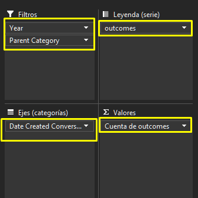
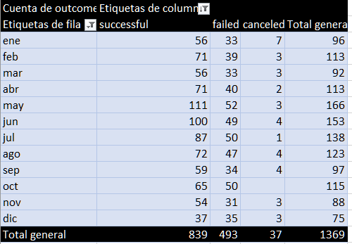
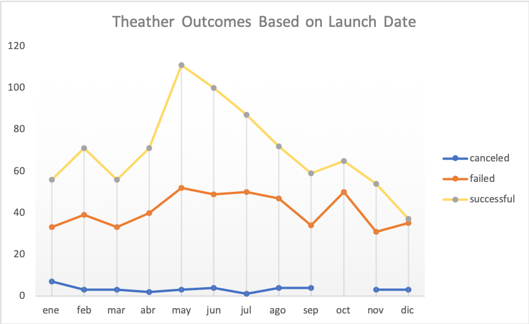
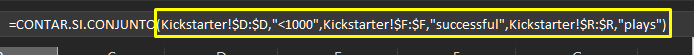
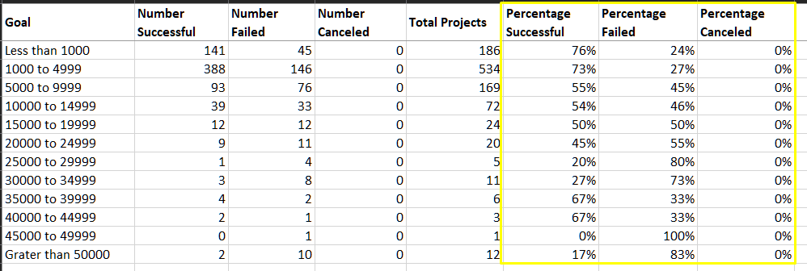
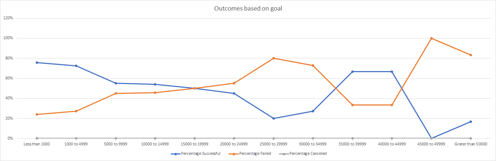

# Kickstarting with Excel

## Overview of Project

The purpose of this analysis is to see the information using pivot tables which will help us review the data in a better an easier way to understand how the Kickstarter campaings have behaved. We can see and search for canceled, successful and failed campaings, filtering by year and knowing the outcome of some of the Subcategories given.

------------------------------------------------------

## Analysis and Challenges

---------------------------------------------------------

### **Analysis of Outcomes Based on Launch Date**
    First of all I started by Selecting all the data in the Kickstarter sheet and then I created a Pivot chart.
    Then I selected the Data that needed to be shown in the analysis.

    
    For the chart that we need to show, the columns and rows need to be specific. 
    This way the cart will show the information needed.

### **Analysis of Outcomes Based on Goals**
    This one was the trickiest one, we have to work with some functions and this functions are new and they require a lot of parameters in order to function the correct way. 

    
    Firt we need to create our table with intervals in the "Goal" column then, using this function, we are going to take all the data we need in the "Kickstarter" sheet, using this function we can select the data that we are going to place in the cells, using only the subcategory "plays" as the one we are going to focus in. 

    Then we get the "Total Projects" using the sum function and with this row we are going to get the percentage nedeeded.

### **Challenges and Difficulties Encountered**
    The **Analysis of Outcomes Based on Launch Date** was the easist one but we have to be aware how we  are using the information, and how to place all the **rows** and **columns**, because it's important to place them to get the information needed.

    Doing the **Analysis of Outcomes Based on Goals** where the most diffcult one because I didn't know how to use the "=CONTAR.SI.CONJUNTO" function and some of the syntax was confusing because there were a lot of parameters that the function need to receive.

    And having all thw cells filled we are going to make aour line graph, showing the Outcome based on goal

    And this way we have all the information needed and we have completed our second sheet.

## **Results**

- What are two conclusions you can draw about the Outcomes based on Launch Date?
    
    The first one is that we can see a decrease in the successful outcomes and the failed are stable, it doesn't have a big change, and the canceled are the ones with a minimum value, and in October the canceled where 0.

    The second one is that with this chart, we can see that maybe the next years the successful ones are going to decrease or stay the same.

- What can you conclude about the Outcomes based on Goals?

    The top goal is between 1,000 to 4,999 and that's because there were more project in this range. 
    And there weren't any Canceled ones.

- What are some limitations of this dataset?

    We are using only the "plays" information, and to get other Subcategories, we need to change the data and the function parameters.

- What are some other possible tables and/or graphs that we could create?

    I think that this are the accurate ones for this information but getting new and more information will led us to get more graphs, using others such as "Histograma" or maybe a "Bar graph" for the Outcomes by laund date.
